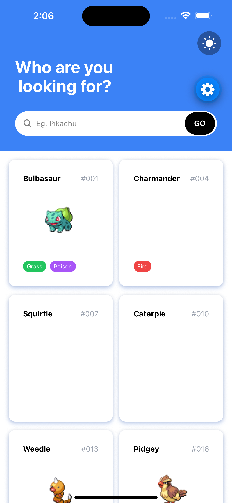
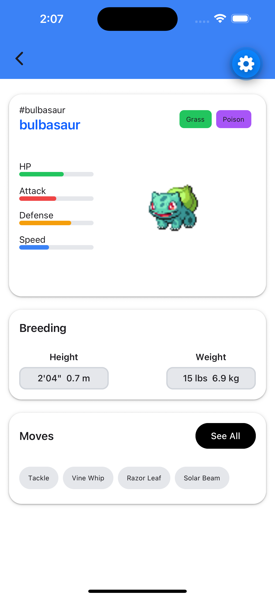
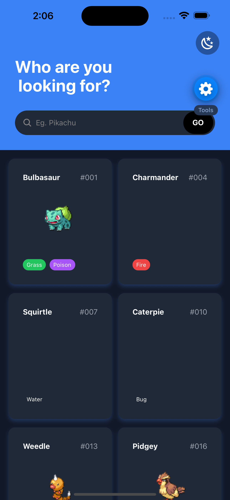
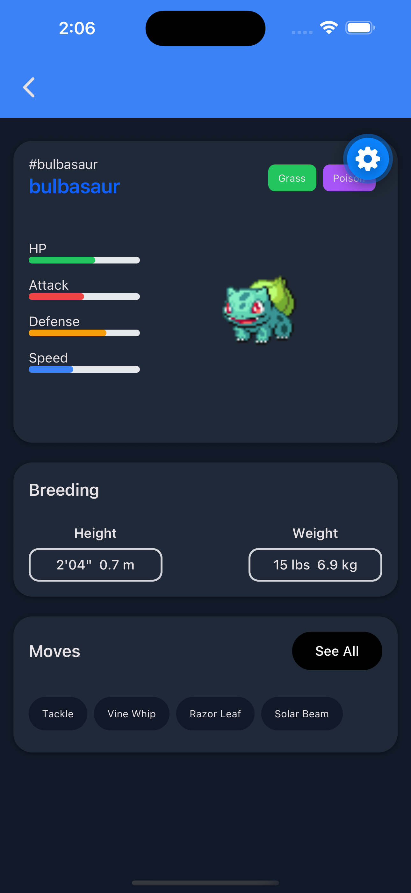

## Eyob's Pokemon App

A clean and modern Pokemon explorer built with Expo and React Native. Browse Pokemon, search them, enjoy nice cards, and switch between beautiful light and dark themes.

---

## Setup Instructions

Follow these steps to get the app running on your machine.

### 1. Clone the Repository

```bash
git clone https://github.com/YobMe/pokemon-test-project.git
cd eyob-pokemon-app
```

### 2. Install Dependencies

```bash
yarn install
```

### 3. Start the Development Server

```bash
yarn start
```

You can also use these shortcuts:

```bash
yarn android   # Run on Android emulator/device
yarn ios       # Run on iOS simulator/device
yarn tes       # Run to test
```

### Requirements

- Node.js (version 18 or higher)
- Yarn
- Expo Go app on your phone (recommended) or Android Studio / Xcode for emulators
- Watchman (on macOS) – helps with file watching

After running `yarn start`, scan the QR code with **Expo Go** or press `a` (Android) or `i` (iOS) in the terminal.

---

## Screenshots

### Light Theme

## Screenshots

### Light Theme

<p>
  
  
</p>

### Dark Theme

<p>
  
  
</p>

_(Add more screenshots here later – e.g. searching, Pokemon cards in action, etc.)_

---

## Features

- Modern Pokemon card design with type badges
- Search functionality
- Smooth animated header
- Light & Dark theme with manual toggle + system preference
- Persistent theme choice (saved with AsyncStorage)
- Clean and responsive UI

---

## Tech Stack & My Decisions

### Why Redux Toolkit?

I decided to use **Redux Toolkit** for both state management and API calls because:

- It greatly reduces boilerplate compared to classic Redux
- RTK Query makes fetching and caching data very simple and efficient
- Built-in tools like `createSlice` and `createApi` keep the code clean and maintainable
- Great developer experience with excellent TypeScript support

This choice helped me manage the Pokemon API data and global theme state in a professional way.

### Theme Implementation

I built a custom theme system using:

- React Context + Redux for persistence
- `react-native-paper` as the base theme provider
- Support for both system dark mode and manual switching
- Colors are consistent across the entire app

I wanted the app to feel polished and respect the user’s preferred appearance.

### Other Tools I Used

- **Expo SDK 55** – Fast development and easy setup
- **NativeWind (Tailwind CSS)** – For fast and clean styling
- **React Navigation** – Smooth screen navigation
- **TypeScript** – Better code quality and fewer bugs

---

## Project Structure

```
src/
├── components├── atoms         # Molecules and reusable components
              ├── molecules
              ├── organisms
              ├── templates           
├── screens/                    # Main app screens
├── theme/                      # Theme files and provider
├── reduxToolkit/               # Store, slices, and API services
├── constants/
├── __tests__/                  # Jest test files
└── types/
```

---

## Running Tests

```bash
yarn test
```

I have added tests for all components like `PokemonCard` and screen `PokemonListScreen`.

---

Made with by **Eyob Adugna**

```

```
